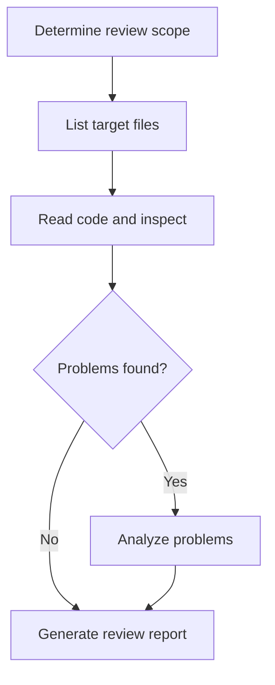

# Code Review Workflow

## Overview

Reviews the specified code (files/directories/workspace), checking syntax, static issues, logic and security risks in order, and finally generates a structured review report to `outputs/review/`. This workflow only reads source files and does not modify code unless the user explicitly asks.

## Flowchart

Every node has a matching step section below; node names are globally unique; the decision node `Problems found?` is explained in step-4 with its branches.

## Steps

### step-1: Determine review scope
- **Tools**: `ask_user` (when no target is given)
- **Input**: `inputs.target`
- **Action**: Confirm the target to review; when absent, locate the directory or file the user mentioned.
- **Check**: Target path is resolved and exists.

### step-2: List target files
- **Tools**: `glob` / `find` / `list_dir`
- **Depends on**: step-1
- **Action**: Collect the list of code files to review (`.ts/.tsx/.js/.py/.json`, etc.), excluding `node_modules`, `dist`, `release`, `uploads`, `downloads`, `outputs`.
- **Check**: The file list is non-empty; process in batches by module when the count exceeds 20.

### step-3: Read code and inspect
- **Tools**: `read_file` / `read_lints`
- **Depends on**: step-2
- **Action**: Read file contents in batches, run `read_lints` for static diagnostics, and record findings (errors, warnings, suspicious logic) per file. Move on only after all batches are processed.
- **Check**: All files in the batch are read and lint results are obtained.
- **when**: If the file list is empty, skip the remaining steps and finish directly.

### step-4: Problems found?
- **Tools**: none needed (judged from step-3 records)
- **Depends on**: step-3
- **Action**: Decide whether there are problems worth analyzing (any error / warning / note) based on the step-3 records.
- **Check**: The verdict is clear: problems / no problems.
- **Branch**: Problems → step-5 Analyze problems; no problems → step-6 Generate review report.

### step-5: Analyze problems
- **Tools**: `grep` / `exec` (when necessary)
- **Depends on**: step-4 verdict "problems"
- **Action**: For each problem, determine severity (error/warning/note), impact scope and fix suggestion; for suspicious logic, grep related symbols to confirm context.
- **Check**: Every recorded problem has a severity and a suggestion.

### step-6: Generate review report
- **Tools**: `write_file`
- **Depends on**: step-4 verdict "no problems" or step-5 done
- **Action**: Write the summary to `outputs/review/review-<timestamp>.md` with: review scope, file list, problem list (sorted by severity, with line numbers/suggestions), overall conclusion.
- **Check**: Report file is written and non-empty. Optionally validate report completeness with `scripts/check_summary.py`.

## Process Rules

- Execute in step order; **do not enter the next batch until the previous batch passes its check**.
- Inspection is read-only; never modify source files unless the user explicitly asks.
- The report must be written to `outputs/review/`, never to `skills/`, `uploads/`, `downloads/`.
- Fatal issues (build failure, obvious security holes) must be pinned to the top of the report and highlighted.

## Tool Call Conventions

- Enumerate files with `glob`/`find`, do not hand-build paths with `ls`.
- Use `read_lints` for static checks (when available on the target), never guess by eye.
- Batch parallel reads: issue all read-only `read_file` calls of one batch at once to reduce round-trips.
- Always use workspace-relative paths.

## Bundled Resources (Level 3, loaded on demand)

- Severity levels and report template → `references/review-reference.md`
- Report completeness validation → `scripts/check_summary.py`
