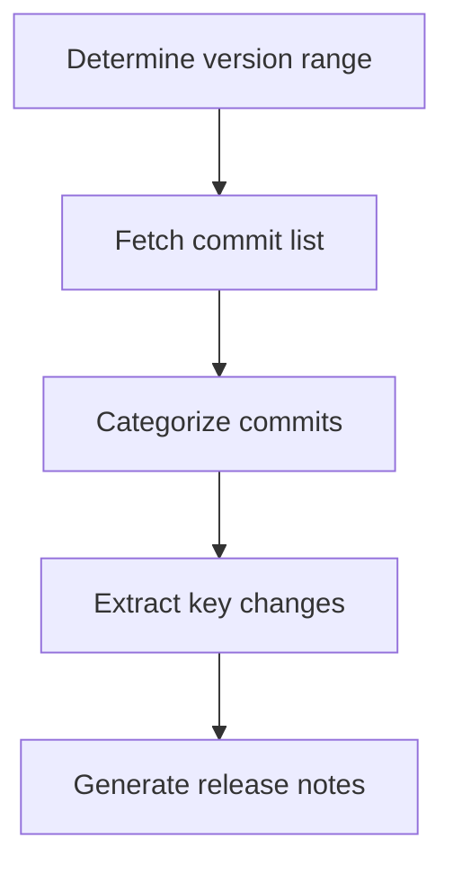

# Release Notes Workflow

## Overview

Extracts the commits between two versions or timestamps from git history, groups them by type (feature/fix/refactor/docs/other), and generates a release notes Markdown file. This workflow only reads git history and never modifies any git state.

## Flowchart

Every node has a matching step section below; node names are globally unique.

## Steps

### step-1: Determine version range
- **Tools**: `exec` (`git log`)
- **Input**: `inputs.from` / `inputs.to`
- **Action**: Run `git log --oneline -5` first to confirm the repo and recent commits; if `from` is not given, prompt for it or fall back to the last 30 days.
- **Check**: The repo is a git repo, and `from`/`to` resolve to valid refs.

### step-2: Fetch commit list
- **Tools**: `exec`
- **Depends on**: step-1
- **Action**: `git log --pretty=format:"%h|%s|%ad" --date=short <from>..<to>` to fetch the commits in range.
- **Check**: The list is non-empty; if empty, state there are no commits in range and finish.

### step-3: Categorize commits
- **Tools**: `exec` (with `grep` if needed) or direct analysis
- **Depends on**: step-2
- **Action**: Group commits by message prefix/keyword: feature (`feat`/added), fix (`fix`/fixed), refactor (`refactor`), docs (`docs`), other.
- **Check**: Every commit is placed into exactly one category; none are skipped.

### step-4: Extract key changes
- **Tools**: `exec` (`git show --stat` for ambiguous entries)
- **Depends on**: step-3
- **Action**: For each key commit, extract changed files, impact scope, and a one-line summary. Merge duplicate items within the same category.
- **Check**: Every category has at least one entry (or is explicitly marked "none").

### step-5: Generate release notes
- **Tools**: `write_file`
- **Depends on**: step-4
- **Action**: Write to `outputs/release/release-notes-<range>.md` with the template: title (version/date), categorized lists, known issues or reminders.
- **Check**: The file is written and non-empty; format is Markdown.

## Process Rules

- Execute in order; **do not categorize until the commit list is fetched**.
- Categorize by commit message; when unclear, verify with `git show --stat` instead of guessing.
- Artifacts go to `outputs/release/`.
- Never modify any git state (no commit, no amend, no rebase).

## Tool Call Conventions

- Run git commands through `exec`, forming each command in one shot to avoid trial-and-error rounds.
- For commits needing batch confirmation, combine output via `git show --stat` to reduce round-trips.
- Keep commit messages in their original language when quoting them in the notes.
