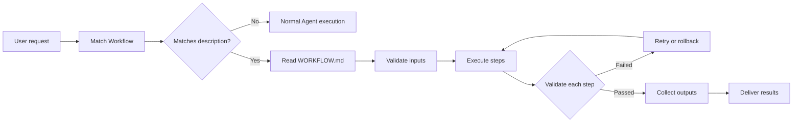
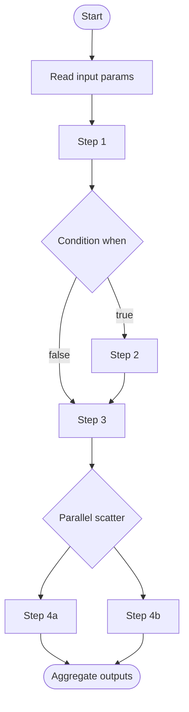
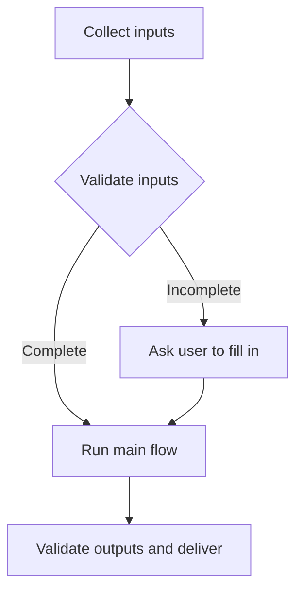

# Workflow Specification v1.0.0

A Workflow is a reusable process unit for the Agent: it translates "what the user wants to do" into "what to do first, what next, which tool each step uses, and what it produces", constrains execution order and rules, and lets the same kind of task run stably and completely every time.

This specification follows the **Progressive Disclosure** mechanism of Agent Skills to organize content: metadata always loads, instructions load when triggered, resources load on demand, avoiding unnecessary context consumption. It also adopts ideas from CWL (Common Workflow Language): explicitly declaring inputs/outputs, connecting data flows step by step, supporting conditional branches and parallelism — but simplified for LLM Agent execution: **steps are completed by the Agent calling tools, not by the engine spawning subprocesses**.

## 1. Why Use Workflows

A Workflow is a reusable, filesystem-based process asset that provides the Agent with procedural orchestration for specific tasks:

- **Make the Agent specialized**: tailor steps and rules for specific task types
- **Reduce repetition**: create once, execute automatically per the flow
- **Compose capabilities**: one Workflow can reference multiple Skills to complete complex tasks

Unlike one-shot prompts, a Workflow loads on demand: before a match, only its name and description occupy context; the full process instructions are read only when triggered.

## 2. How Workflows Work: Three-Level Progressive Disclosure

Like Agent Skills, Workflows use a **progressive disclosure** architecture: the Agent loads information in stages as needed instead of consuming all context up front.

Each Workflow can contain three types of content, each loaded at a different time:

### Level 1: Metadata (always loaded)

The YAML frontmatter of `WORKFLOW.md` provides discovery information:

```yaml
---
name: code-review
description: Review workspace code changes for bugs, quality, and safety before delivery. Use when the user asks to review code, check for problems, or verify a change set.
version: 1
inputs: [...]
outputs: [...]
tags: [code, review]
---
```

The Agent includes the metadata in the system prompt on every request. `description` is what matches user requests and must state both what the flow does and when to use it. This lightweight approach lets you install many Workflows without context cost: until triggered, only their names and descriptions occupy context.

### Level 2: Instructions (loaded when triggered)

The body of `WORKFLOW.md` contains procedural knowledge: mermaid flowchart, ordered steps, process rules and tool-call conventions. When a user request matches a Workflow's description, the Agent reads `WORKFLOW.md` via `read_file` or `workflow_get`. Only then does this content enter the context window.

### Level 3: Resources and code (loaded on demand)

A Workflow can bundle additional materials in three kinds of directories:

```text
code-review/
├── WORKFLOW.md          (main instructions)
├── references/          (docs, markdown — loaded in full when read)
│   └── review-reference.md
├── scripts/             (executable code — only output enters context)
│   └── check_summary.py
└── assets/              (templates / data — read on demand or used as output)
    └── report-template.md
```

| Directory | Content | Loading semantics |
| --- | --- | --- |
| `references/` | documentation (markdown, e.g. rule tables) | the full file enters context when read via `read_file` |
| `scripts/` | executable code | run via `exec`; only the script's output enters context, never the source |
| `assets/` | templates, examples, data files | read on demand, or consumed as output materials |

The Agent only accesses these files when `WORKFLOW.md` references them. Bundled content consumes no context until accessed, so it can include comprehensive reference docs or many examples.

### Load Timing and Token Cost

| Level | Load timing | Token cost | Content |
| --- | --- | --- | --- |
| **Level 1: Metadata** | Always (every request) | ~50–150 tokens per Workflow | `name` / `description` / `tags` in frontmatter |
| **Level 2: Instructions** | When the Workflow is triggered | Usually <5k tokens depending on step count | `WORKFLOW.md` body: flowchart, steps, rules, tool conventions |
| **Level 3: Resources** | On demand | Zero until accessed | `references/` docs (loaded when read), `scripts/` (only output enters context), `assets/` (templates/data) |

> Consistent with the Skills directory: `<workspace>/workflows/<name>/WORKFLOW.md` is the entry point; `references/` docs are read on demand, `scripts/` run via `exec` (only their output consumes tokens), `assets/` are read on demand or used as output.

## 3. Overall Flow



Execution flow defined by a Workflow:



## 4. Directory Structure

```
<workspace>/workflows/            ← workspace custom workflows (learnable/modifiable by the Agent)
├── code-review/
│   ├── WORKFLOW.md               ← required, process definition (Level 1 + Level 2)
│   ├── references/               ← optional, docs loaded on demand (Level 3)
│   ├── scripts/                  ← optional, deterministic scripts (Level 3)
│   └── assets/                   ← optional, template/example resources (Level 3)
└── release-notes/
    └── WORKFLOW.md

<project>/workflows/              ← builtin workflows (bundled for distribution, read-only)
```

When a workspace workflow has the same name as a builtin one, **the workspace one overrides the builtin**. Agent self-learning can only write to `workspace/workflows/`.

## 5. WORKFLOW.md Format

Each workflow is a directory whose core file `WORKFLOW.md` contains the Level 1 frontmatter and the Level 2 instruction body:

```markdown
---
name: <workflow-name-kebab-case>
description:
  One sentence stating what problem this flow solves and when it triggers
  (the scenario in which the user would use it).
  Like the SKILL.md description, this is the key to triggering. Must state
  both function and usage timing.
version: 1
inputs:
  - id: <input-id>
    type: string | file | directory | array
    description: input description
    required: true
outputs:
  - id: <output-id>
    type: file | string
    description: output description
tags: [optional, categories]
---

# Flow Title

## Overview

(A paragraph stating what this flow does, when to use it, and what it ultimately produces.)

## Flowchart

Node names correspond one-to-one with the step sections below and are globally unique (the `step-N` prefix need not appear in nodes; decision nodes like `Validate inputs` also have step sections).



## Steps

### step-1: Collect inputs
- **Tools**: `list_dir` / `glob`
- **Input**: from `inputs.<input-id>`
- **Action**: locate and collect the base materials needed by this flow (directory / file lists), record their paths.
- **Check**: material paths resolved, list non-empty.

### step-2: Validate inputs
- **Tools**: `glob` / `read_file`
- **Depends on**: step-1 succeeded
- **Action**: check each required item against the `inputs` declaration for existence and format; record the result as "complete / incomplete".
- **Check**: every required input has a clear pass / missing conclusion.
- **Branch**: complete → go to step-4; incomplete → go to step-3.

### step-3: Ask user to fill in inputs
- **Tools**: `ask_user`
- **Depends on**: step-2 judged "incomplete"
- **Action**: list the missing inputs and ask the user to fill them in (or choose to skip / use defaults).
- **Check**: the user has provided values or explicitly authorized skipping; after filling, return to step-2 to re-validate.

### step-4: Run main flow
- **Tools**: `read_file` / `write_file`
- **Depends on**: step-2 judged "complete" or step-3 filled in
- **Action**: process the data step by step toward the flow goal and produce result files (written to `outputs/`).
- **Check**: result files generated and non-empty, content consistent with the inputs.

### step-5: Validate outputs and deliver
- **Tools**: `glob` / `read_file`
- **Depends on**: step-4 succeeded
- **Action**: re-check that all declared `outputs` are produced, and deliver the result paths and summary to the user.
- **Check**: all outputs exist and are correct; if any is missing, return to step-4 to fix.

## Process Rules

- Rule one: ...
- Rule two: validate after each step before moving to the next

## Tool Call Conventions

- Prefer builtin tools, then exec, then scripts.
- How each step's tool-call arguments are derived from context.
```

### 5.1 Frontmatter Fields (Level 1 Metadata)

| Field | Required | Description |
| --- | --- | --- |
| `name` | Yes | workflow identifier, kebab-case, matching the directory name. Lowercase letters, digits, hyphens only |
| `description` | Yes | trigger description. **Must not be empty**, must state both function and usage timing, used to match user requests |
| `version` | No | version number |
| `inputs` | No | input parameter declaration (adopts CWL inputs) |
| `outputs` | No | output declaration (adopts CWL outputs) |
| `tags` | No | category tags |

### 5.2 Step Definition (adopts CWL steps)

Each step is described with a `### <id>: <name>` sub-section. Step attributes:

| Attribute | Description |
| --- | --- |
| `Tools` | tool names this step should use, can be multiple |
| `Input` | which inputs/upstream steps to take data from |
| `Depends on` | which steps must complete first |
| `Action` | what specifically to do (instructions) |
| `Check` | success criteria; if not met, retry or fail |
| `when` | optional, condition expression (adopts CWL `when`); this step runs only if satisfied |
| `Branch` | optional, decision nodes only: states which step each branch goes to |

#### 5.2.1 Node Naming and Uniqueness (Graph-Step Correspondence Rules)

The flowchart and step sections must correspond **one-to-one**; this is key for the Agent to determine execution order from the graph:

- **Each step appears exactly once**: every node in the graph must have a corresponding step section, and every step section must appear once in the graph. "A node without a step section" or "a step without a graph node" is not allowed.
- **Node name = step name, exactly matching**: the mermaid node text must exactly match the `<name>` in the corresponding step section `### <id>: <name>` (including case and spaces). For example, the `Collect inputs` node in the graph corresponds to `### step-1: Collect inputs`.
- **`<id>` need not appear in nodes**: prefixes like `step-1` are only for ordering and dependency references in step sections; whether to write them into mermaid node text is optional. As long as **node names are globally unique**, the Agent can uniquely locate the corresponding step section from the graph.
- **Decision nodes are also steps**: diamond nodes `{...}` (e.g. `{Validate inputs}`) must also have a corresponding step section, with a `Branch` attribute describing where each branch goes (e.g. `complete → step-4; incomplete → step-3`).
- **Avoid ambiguous names**: if two step names are similar or contain generic words (e.g. "check", "process"), use more specific, distinguishable names to keep the whole graph unique.
- **scatter parallel groups also enter the graph**: a parallel group is one node in the graph; its sub-steps are listed in parallel in the step sections, and the node name matches the "parallel group" section name.

### 5.3 Parallelism (adopts CWL scatter)

Multiple independent steps can run in parallel. Mark them with `### scatter: Parallel group` and list the parallel sub-steps inside the group. The Agent issues multiple independent read-only tool calls at once (consistent with the tool-declared `meta.parallelSafe` mechanism).

## 6. Process Rule Constraints

Rules are written in the `## Process Rules` section and injected into the execution context as hard constraints. Common rule categories:

- **Graph-Step consistency**: flowchart nodes and step sections correspond one-to-one, node names globally unique (see 5.2.1); when graph and text disagree, the step sections take precedence and the graph is fixed.
- **Order constraints**: one step must precede another (expressed by arrows in the mermaid graph, restated in text)
- **Data dependencies**: downstream steps can only consume outputs declared by upstream steps
- **Validation gates**: how to handle a failed step check (retry N times / rollback / ask the user)
- **Side-effect constraints**: only write to designated directories (e.g. `outputs/`), never touch `skills/`, `uploads/`, etc.
- **Final-state check**: verify all outputs are produced before the flow ends

## 7. Tool Call Usage Conventions

The tools used in each step should follow the project-wide tool-call conventions:

1. **Prefer builtin tools**: if `read_file` / `list_dir` / `grep` / `glob` / `find` / `read_lints` / `web_search` / `web_fetch` / `download_url` / `exec` cover the need, don't start a Python script.
2. **Scripts as fallback**: use Python for structured parsing and non-trivial logic; put scripts in `outputs/` or the workflow's `scripts/`.
3. **Read more, write less**: batch parallel read-only calls whenever possible; keep write operations to the necessary minimum.
4. **Path conventions**: workspace-relative paths; artifacts go to `outputs/`.
5. **Step tools match instructions**: the "Tools" field declared in a step defines the tool set available for that step.

## 8. Execution Semantics (How the Agent Executes)

After the Agent matches a workflow:

1. Read `workflows/<name>/WORKFLOW.md` with `read_file` (or via `workflow_get`).
2. Parse the inputs in the frontmatter and ask the user to fill in missing required inputs (via `ask_user`).
3. Determine execution order from the mermaid graph / step sections and execute step by step:
   - Each step: call tools per "Tools/Input/Action" → validate the "Check" criteria → only pass to the next step on success.
   - Skip the step if the `when` condition is not satisfied.
   - In a parallel group, issue multiple read-only calls at once.
4. After all steps complete, aggregate the outputs and deliver them to the user.
5. If a step fails and cannot satisfy its check: follow the failure handling in "Process Rules" (retry / ask / rollback), never continue silently.

## 9. Security Considerations

Workflows give the Agent new capabilities through instructions and scripts; a malicious Workflow may direct the Agent to call tools or execute code in ways inconsistent with its stated purpose.

- **Audit thoroughly**: review every file bundled with a Workflow (WORKFLOW.md, scripts, reference resources) for anomalous patterns (unexpected network calls, file-access patterns, operations inconsistent with the stated purpose)
- **External sources carry risk**: Workflows that fetch data or instructions from external URLs are especially risky
- **Tool abuse**: a malicious Workflow may call tools in harmful ways (file operations, bash commands, code execution)
- **Data exposure**: a Workflow with access to sensitive data may be designed to leak information

Only use Workflows from trusted sources: ones you created, or ones bundled with the project. Thoroughly audit any untrusted Workflow before using it.

## 10. Relationship to Other Mechanisms

- **Skills vs Workflows**: a Skill is "knowledge/capability in a domain"; a Workflow is "process orchestration to complete a class of tasks". One workflow can reference multiple skills (e.g. an OCR workflow references the rapidocr skill).
- **Self-learning**: the Agent can solidify multi-step routines it has learned into `workspace/workflows/<name>/WORKFLOW.md`, following this specification.
- **Trigger matching**: `description` is the primary matching basis (same as SKILL.md); once matched, read the full text and execute.

## 11. Authoring Guidelines and Best Practices

When writing `WORKFLOW.md`:

1. **One workflow solves one class of task**; don't pile unrelated flows together.
2. **The flowchart must be complete and correspond one-to-one with the steps**: draw the start, branches, parallelism, and end clearly; every node must have a matching step section (including decision nodes); node names globally unique and exactly matching step names (see 5.2.1). Self-check after writing: are there "orphan" nodes in the graph, or "orphan" steps in the sections?
3. **Check criteria must be concrete and decidable**: e.g. "file exists and is non-empty" rather than "confirm success".
4. **Tool names must be precise**: write real tool names like `read_file` / `exec`, not vague descriptions like "view the file".
5. **Declare inputs/outputs explicitly**: steps that depend on upstream data should note the source.
6. **Keep it short**: keep steps to 3–8; split or reference a sub-flow beyond that.
7. **Description quality determines trigger rate**: include function + usage timing + trigger words, covering the various phrasings users may use.
8. **Use progressive disclosure well**: put long docs and tables in `references/`, deterministic logic in `scripts/`, templates and data in `assets/`, keeping the WORKFLOW.md body lean (<500 lines ideally).
9. **Explain the "why"**: besides instructions, explain the purpose behind each step so the Agent can adapt correctly on edge cases, avoiding rigid MUST/ALWAYS piles.

## 12. Examples and Tools

Complete runnable examples:

- [examples/code-review/](examples/code-review/) — full three-level structure example (WORKFLOW.md + references/ + scripts/)
- [examples/release-notes/](examples/release-notes/) — concise example (WORKFLOW.md only)

> Note: the examples in this spec are for learning structure; the actually executable workflows live in `<workspace>/workflows/` and `<project>/workflows/`.

### The Create-Workflow Skill

To create or modify a workflow, use the `workflow-creator` skill: it guides the Agent through the full flow from requirements interview, flowchart design (graph-step one-to-one correspondence) to WORKFLOW.md authoring and self-check. Skill docs:

- Spec version: [skills/workflow-creator/SKILL.md](skills/workflow-creator/SKILL.md)
- Builtin skill: `skills/workflow-creator/SKILL.md` (auto-loaded by the Agent at runtime)

Users can directly ask "create a workflow"; the Agent reads the skill and follows it.
