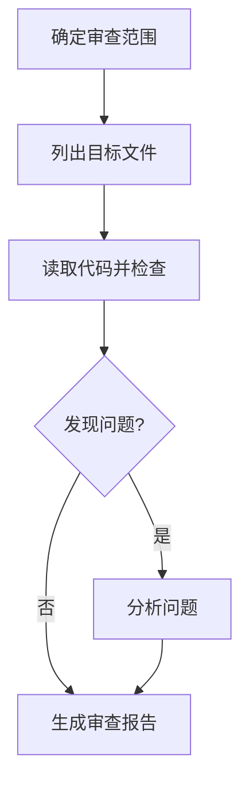

# Code Review 代码审查流程

## 流程总览

审查指定代码（文件/目录/工作区），按顺序检查语法、静态问题、逻辑与安全风险，最后生成一份结构化审查报告到 `outputs/review/`。此流程只读审查源文件，除非用户明确要求，不直接修改代码。

## 流程图

节点名与步骤小节一一对应、全局唯一；判断节点 `发现问题?` 在 step-4 有独立说明与分支。

## 步骤

### step-1: 确定审查范围
- **工具**: `ask_user`（目标未指定时）
- **输入**: `inputs.target`
- **动作**: 确认要审查的目标；缺省时定位到用户提到的目录或文件。
- **校验**: 目标路径已确定且存在。

### step-2: 列出目标文件
- **工具**: `glob` / `find` / `list_dir`
- **前置**: step-1
- **动作**: 收集待审查代码文件清单（`.ts/.tsx/.js/.py/.json` 等），排除 `node_modules`、`dist`、`release`、`uploads`、`downloads`、`outputs`。
- **校验**: 文件清单非空；数量超过 20 时按模块分批处理。

### step-3: 读取代码并检查
- **工具**: `read_file` / `read_lints`
- **前置**: step-2
- **动作**: 按批次读取文件内容，运行 `read_lints` 获取静态诊断；逐文件记录发现的问题（错误、警告、可疑逻辑）。所有批次处理完毕才进入下一步。
- **校验**: 该批次文件全部读取，lint 结果已获取。
- **when**: 文件清单为空则跳过后续步骤并直接结束。

### step-4: 发现问题?
- **工具**: 无需额外工具（依据 step-3 记录判定）
- **前置**: step-3
- **动作**: 依据 step-3 的记录判断是否存在需要分析的问题（error / warning / note 任一）。
- **校验**: 判定结论明确：有问题 / 无问题。
- **分支**: 有问题 → step-5 分析问题；无问题 → step-6 生成审查报告。

### step-5: 分析问题
- **工具**: `grep` / `exec`（必要时）
- **前置**: step-4 判定"有问题"
- **动作**: 对每个问题判定严重级（error/warning/note）、影响面与修复建议；对可疑逻辑可 grep 关联符号确认上下文。
- **校验**: 每个记录的问题都有级别与建议。

### step-6: 生成审查报告
- **工具**: `write_file`
- **前置**: step-4 判定"无问题" 或 step-5 完成
- **动作**: 汇总到 `outputs/review/review-<timestamp>.md`，包含：审查范围、文件清单、问题清单（按严重度排序，含行号/建议）、总体结论。
- **校验**: 报告文件已写入且非空。可用 `scripts/check_summary.py` 校验报告完整性。

## 流程规则

- 按步骤顺序执行，**未完成上一批的校验不进入下一批**。
- 只读检查过程不修改任何源文件；除非用户明确要求，审查不直接改代码。
- 报告必须写入 `outputs/review/`，不写入 `skills/`、`uploads/`、`downloads/`。
- 发现致命错误（编译失败、明显安全漏洞）时在报告中置顶并高亮。

## 工具调用规范

- 文件枚举用 `glob`/`find`，不手工 `ls` 拼路径。
- 静态检查用 `read_lints`（若目标目录可用），不靠肉眼猜。
- 分批并行读取：同一批次的只读 `read_file` 一次发出，减少轮次。
- 路径一律使用工作区相对路径。

## 捆绑资源（Level 3，按需加载）

- 严重度分级与报告模板 → `references/review-reference.md`
- 报告完整性校验 → `scripts/check_summary.py`
