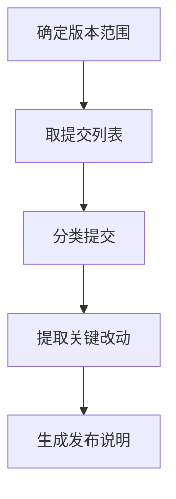

# Release Notes 发布说明生成流程

## 流程总览

从 git 历史中提取两个版本/时间点之间的提交，按类型（特性/修复/重构/文档/其他）归类，生成发布说明 Markdown 文件。此流程只读 git 历史，不修改任何 git 状态。

## 流程图

节点名与步骤小节一一对应、全局唯一。

## 步骤

### step-1: 确定版本范围
- **工具**: `exec`（`git log`）
- **输入**: `inputs.from` / `inputs.to`
- **动作**: 先 `git log --oneline -5` 确认仓库与近期提交；若 `from` 未给，提示或回退为最近 30 天。
- **校验**: 仓库是 git 仓库，`from`/`to` 可解析为合法 ref。

### step-2: 取提交列表
- **工具**: `exec`
- **前置**: step-1
- **动作**: `git log --pretty=format:"%h|%s|%ad" --date=short <from>..<to>` 获取范围提交。
- **校验**: 列表非空；为空则说明范围内无提交并结束。

### step-3: 分类提交
- **工具**: `exec`（`grep` 辅助）或直接分析
- **前置**: step-2
- **动作**: 按 commit message 前缀/关键词归类：特性(`feat`/新增)、修复(`fix`/修复/修复了)、重构(`refactor`)、文档(`docs`)、其他。
- **校验**: 每条提交都被归入某类，无遗漏。

### step-4: 提取关键改动
- **工具**: `exec`（`git show --stat`，对模糊条目）
- **前置**: step-3
- **动作**: 对每条关键提交提取：改动文件、影响范围、一句话说明。合并同类重复项。
- **校验**: 每类至少有一条（或明确标注"无"）。

### step-5: 生成发布说明
- **工具**: `write_file`
- **前置**: step-4
- **动作**: 写入 `outputs/release/release-notes-<range>.md`，模板为：标题（版本/日期）、各分类列表、已知问题或提醒。
- **校验**: 文件已写入且非空；格式为 Markdown。

## 流程规则

- 顺序执行，**未取到提交列表不得分类**。
- 提交分类以 message 为准；含义不明时用 `git show --stat` 求证，不猜测。
- 产物写入 `outputs/release/`。
- 不修改任何 git 状态（不 commit、不 amend、不 rebase）。

## 工具调用规范

- git 命令通过 `exec` 执行，命令一次成型，避免多轮试探。
- 需要批量确认的提交用 `git show --stat` 合并输出，减少轮次。
- 中文回复时，说明中的 commit 原文保留英文、说明用中文。
