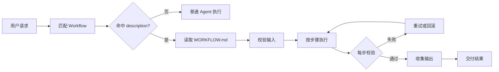
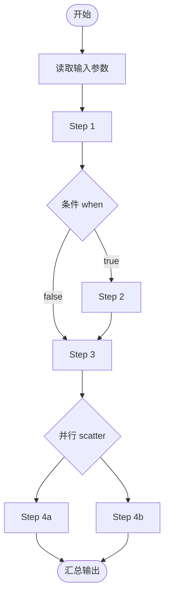
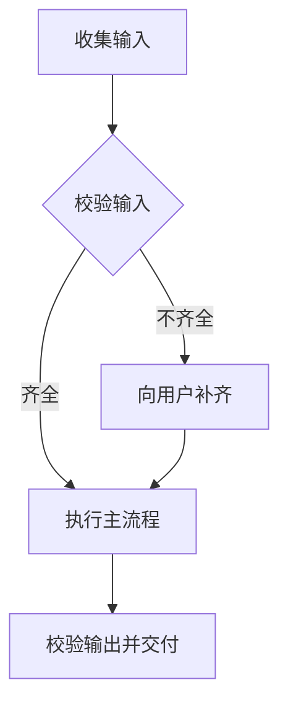

# Workflow 流程规范 v1.0.0

Workflow 是 Agent 的可复用流程单元：把"用户想做什么"翻译成"先做什么、再做什么、每步用什么工具、产出什么"，约束执行顺序与规则，让同一类任务每次都能稳定、完整地跑通。

本规范参照 Agent Skills 的**渐进式披露**（Progressive Disclosure）机制组织内容：元数据始终加载、指令触发时加载、资源按需加载，避免无谓消耗上下文；同时吸收 CWL（Common Workflow Language）的思想：显式声明输入输出、按步骤连接数据流、支持条件分支与并行，但面向 LLM Agent 执行做了简化——**步骤由 Agent 调用工具完成，而不是由引擎拉起子进程**。

## 1. 为什么使用 Workflow

Workflow 是可复用的、基于文件系统的流程资产，为 Agent 提供特定任务的过程编排：

- **让 Agent 专业化**：为特定任务类型定制步骤与规则
- **减少重复**：创建一次，自动按流程执行
- **组合能力**：一个 Workflow 可引用多个 Skill，组合完成复杂任务

与一次性提示不同，Workflow 按需加载：匹配之前只有名称和描述占用上下文，触发时才读取完整流程指令。

## 2. Workflow 的工作原理：三级渐进式披露

参照 Agent Skills，Workflow 采用**渐进式披露**架构：Agent 根据需要分阶段加载信息，而不是预先消耗全部上下文。

每个 Workflow 可以包含三种类型的内容，每种内容在不同时间加载：

### Level 1：元数据（始终加载）

`WORKFLOW.md` 的 YAML frontmatter 提供发现信息：

```yaml
---
name: code-review
description: Review workspace code changes for bugs, quality, and safety before delivery. Use when the user asks to review code, check for problems, or verify a change set.
version: 1
inputs: [...]
outputs: [...]
tags: [code, review]
---
```

Agent 每次请求时把元数据包含在系统提示中。`description` 是匹配用户请求的依据，必须同时说明流程的功能和何时使用它。这种轻量级方法让你可以安装许多 Workflow 而不会产生上下文损耗：在触发之前，只有其名称和描述占用上下文。

### Level 2：指令（触发时加载）

`WORKFLOW.md` 的主体包含程序性知识：mermaid 流程图、有序步骤、流程规则与工具调用规范。当用户请求与某个 Workflow 的 description 匹配时，Agent 通过 `read_file` 或 `workflow_get` 读取 `WORKFLOW.md`。只有在此时，这些内容才会进入上下文窗口。

### Level 3：资源和代码（按需加载）

Workflow 可以在三类目录中捆绑额外材料：

```text
code-review/
├── WORKFLOW.md          (主指令)
├── references/          (文档，markdown —— 读取时全文进上下文)
│   └── review-reference.md
├── scripts/             (可执行代码 —— 只有输出进上下文)
│   └── check_summary.py
└── assets/              (模板 / 数据 —— 按需读取或作为输出产物)
    └── report-template.md
```

| 目录 | 内容 | 加载语义 |
| --- | --- | --- |
| `references/` | 文档（markdown 为主，如规则表） | 经 `read_file` 读取时全文进入上下文 |
| `scripts/` | 可执行代码 | 经 `exec` 运行；只有输出进入上下文，源码永不进入 |
| `assets/` | 模板、示例、数据文件 | 按需读取，或作为输出材料使用 |

Agent 仅在 `WORKFLOW.md` 中引用时才访问这些文件。捆绑内容在被访问前不消耗上下文，因此可以包含全面的参考文档或大量示例。

### 加载时机与令牌成本

| 级别 | 加载时机 | 令牌成本 | 内容 |
| --- | --- | --- | --- |
| **Level 1：元数据** | 始终（每次请求） | 每个 Workflow 约 50–150 tokens | frontmatter 中的 `name` / `description` / `tags` |
| **Level 2：指令** | Workflow 被触发时 | 依步骤数量，通常 <5k tokens | `WORKFLOW.md` 主体：流程图、步骤、规则、工具规范 |
| **Level 3：资源** | 按需 | 访问前为零 | `references/` 文档（读取时加载）、`scripts/`（仅输出进入上下文）、`assets/`（模板/数据） |

> 与 Skills 目录一致：`<workspace>/workflows/<name>/WORKFLOW.md` 是入口，`references/` 文档按需读取，`scripts/` 通过 `exec` 运行（只有输出消耗令牌），`assets/` 按需读取或作为输出。

## 3. 总体流程



Workflow 定义的执行流：



## 4. 目录结构

```
<workspace>/workflows/            ← 工作区自定义 workflow（可被 Agent 学习/修改）
├── code-review/
│   ├── WORKFLOW.md               ← 必选，流程定义（Level 1 + Level 2）
│   ├── references/               ← 可选，按需加载的参考文档（Level 3）
│   ├── scripts/                  ← 可选，确定性脚本（Level 3）
│   └── assets/                   ← 可选，模板/示例资源（Level 3）
└── release-notes/
    └── WORKFLOW.md

<project>/workflows/              ← 内置 workflow（打包分发，只读）
```

工作区 workflow 与内置 workflow 同名时，**工作区覆盖内置**。Agent 的 self-learning 只能写 `workspace/workflows/`。

## 5. WORKFLOW.md 格式

每个 workflow 是一个目录，核心文件 `WORKFLOW.md`，包含 Level 1 frontmatter 与 Level 2 指令主体：

```markdown
---
name: <workflow-name-kebab-case>
description:
  一句话说明此流程解决什么问题，何时触发（用户在什么场景下会用到）。
  与 SKILL.md 的 description 一样，是触发的关键。必须同时说明功能与使用时机。
version: 1
inputs:
  - id: <input-id>
    type: string | file | directory | array
    description: 输入说明
    required: true
outputs:
  - id: <output-id>
    type: file | string
    description: 产出说明
tags: [可选, 分类]
---

# 流程标题

## 流程总览

（一段话说明这个流程在做什么、何时用、最终产出什么。）

## 流程图

节点名与下方步骤小节的名称一一对应、全局唯一（`step-N` 前缀不必写进节点；判断节点 `校验输入` 同样有步骤说明）。



## 步骤

### step-1: 收集输入
- **工具**: `list_dir` / `glob`
- **输入**: 从 `inputs.<input-id>` 获取
- **动作**: 定位并收集本流程所需的基础材料（目录 / 文件清单），记录路径。
- **校验**: 材料路径已解析，清单非空。

### step-2: 校验输入
- **工具**: `glob` / `read_file`
- **前置**: step-1 成功
- **动作**: 对照 `inputs` 声明逐一检查必填项是否存在、格式是否正确；将检查结果记为"齐全 / 不齐全"。
- **校验**: 每个必填输入都有明确的通过 / 缺失结论。
- **分支**: 齐全 → 进入 step-4；不齐全 → 进入 step-3。

### step-3: 向用户补齐输入
- **工具**: `ask_user`
- **前置**: step-2 判定"不齐全"
- **动作**: 列出缺失的输入项，向用户询问补齐（或选择跳过 / 用默认值）。
- **校验**: 用户已给出补充值或明确授权跳过；补齐后回到 step-2 复查。

### step-4: 执行主流程
- **工具**: `read_file` / `write_file`
- **前置**: step-2 判定"齐全" 或 step-3 补齐完成
- **动作**: 按流程目标逐步处理数据并产出结果文件（写入 `outputs/`）。
- **校验**: 结果文件已生成且非空，内容与输入一致。

### step-5: 校验输出并交付
- **工具**: `glob` / `read_file`
- **前置**: step-4 成功
- **动作**: 复核全部 `outputs` 声明均已产出，将结果路径与摘要交付给用户。
- **校验**: 所有输出存在且内容正确；缺项则回到 step-4 修正。

## 流程规则

- 规则一：...
- 规则二：每步完成后校验再进入下一步

## 工具调用规范

- 优先使用内置工具，其次 exec，最后脚本。
- 每步工具的调用参数如何从上下文推导。
```

### 5.1 Frontmatter 字段（Level 1 元数据）

| 字段 | 必选 | 说明 |
| --- | --- | --- |
| `name` | 是 | workflow 标识，kebab-case，与目录名一致。仅小写字母、数字、连字符 |
| `description` | 是 | 触发描述。**不能为空**，需同时说明功能与使用时机，用于匹配用户请求 |
| `version` | 否 | 版本号 |
| `inputs` | 否 | 输入参数声明（吸收 CWL inputs） |
| `outputs` | 否 | 输出声明（吸收 CWL outputs） |
| `tags` | 否 | 分类标签 |

### 5.2 步骤定义（吸收 CWL steps）

每个步骤用一个 `### <id>: <名称>` 二级小节描述。步骤属性：

| 属性 | 说明 |
| --- | --- |
| `工具` | 本步骤应使用的工具名，可多个 |
| `输入` | 从哪些输入/上游步骤取数据 |
| `前置` | 依赖哪些步骤完成 |
| `动作` | 具体做什么（指令） |
| `校验` | 成功判据，不满足则重试或失败 |
| `when` | 可选，条件表达式（吸收 CWL `when`），满足才执行本步 |
| `分支` | 可选，仅判断节点：说明各分支进入哪个步骤 |

#### 5.2.1 节点命名与唯一性（图步对应规则）

流程图与步骤小节必须**一一对应**，这是 Agent 从图定位执行顺序的关键：

- **一个步骤恰好出现一次**：图中每个节点必须有一个对应的步骤小节，每个步骤小节也必须在图中出现一次。不允许出现"图中有节点、无步骤说明"或"有步骤、无图节点"。
- **节点名 = 步骤名称，完全一致**：mermaid 节点文本必须与对应步骤小节 `### <id>: <名称>` 中的 `<名称>` 完全一致（含大小写与空格），例如图中 `收集输入` 节点对应 `### step-1: 收集输入`。
- **`<id>` 不必写进节点**：`step-1` 这类前缀只用于步骤小节排序与前置引用，是否写进 mermaid 节点文本均可。只要**节点名称全局唯一**，Agent 就能从图唯一定位到对应步骤小节。
- **判断节点也是步骤**：菱形节点 `{...}`（如 `{校验输入}`）同样必须有对应步骤小节，并在其中用 `分支` 属性说明每个分支的去向（如 `齐全 → step-4；不齐全 → step-3`）。
- **避免歧义名称**：若两个步骤名称相似或含通用词（如"检查"、"处理"），改用更具体、可区分的名称，保证全图唯一。
- **scatter 并行组同样入图**：并行组在图中是一个节点，组内子步骤在步骤小节中并列列出，节点名与"并行组"小节名称一致。

### 5.3 并行（吸收 CWL scatter）

多个互不依赖的步骤可以并行执行。用 `### scatter: 并行组` 标识，并在组内列出各并行子步骤。Agent 一次发出多个独立的只读工具调用（与工具声明的 `meta.parallelSafe` 机制一致）。

## 6. 流程规则约束

规则写在 `## 流程规则` 一节，作为强制约束注入执行上下文。常见规则类别：

- **图步一致性**：流程图节点与步骤小节一一对应、节点名全局唯一（见 5.2.1）；图与文字出现不一致时以步骤小节为准并修正图。
- **顺序约束**：某步骤必须先于另一步骤（mermaid 图中箭头表达，文字中重申）
- **数据依赖**：下游步骤只能消费上游声明的输出
- **校验门禁**：每步校验失败的处理方式（重试 N 次 / 回滚 / 询问用户）
- **副作用约束**：只允许在指定目录写入（如 `outputs/`），不触碰 `skills/`、`uploads/` 等
- **终态检查**：流程结束前验证全部 outputs 已生成

## 7. 工具调用使用规范

流程中每一步使用的工具应遵循项目统一的工具调用规范：

1. **优先内置工具**：`read_file` / `list_dir` / `grep` / `glob` / `find` / `read_lints` / `web_search` / `web_fetch` / `download_url` / `exec` 能覆盖的，不另起 Python。
2. **脚本兜底**：结构化解析、非平凡逻辑用 Python；脚本放在 `outputs/` 或 workflow 的 `scripts/`。
3. **读多写少**：尽量批量并行只读；写操作减少到必要次数。
4. **路径规范**：工作区相对路径；产物写入 `outputs/`。
5. **每步工具与说明匹配**：步骤声明的"工具"字段决定本步可用工具集合。

## 8. 执行语义（Agent 如何执行）

Agent 命中 workflow 后：

1. 用 `read_file` 读取 `workflows/<name>/WORKFLOW.md`（或通过 `workflow_get`）。
2. 解析 frontmatter 的 inputs，向用户补齐缺失的必填输入（用 `ask_user`）。
3. 从 mermaid 图 / 步骤小节确定执行顺序，逐步执行：
   - 每步：按"工具/输入/动作"调用工具 → 校验"校验"条件 → 通过才进入下一步。
   - 条件 `when` 不满足则跳过本步。
   - 并行组内步骤一次发出多个只读调用。
4. 全部步骤完成后，汇总 outputs 交付给用户。
5. 如果某步失败且无法满足校验：按"流程规则"中的失败处理执行（重试 / 询问 / 回滚），不静默继续。

## 9. 安全注意事项

Workflow 通过指令和脚本为 Agent 提供新能力，恶意 Workflow 可能指示 Agent 以与声明用途不符的方式调用工具或执行代码。

- **彻底审计**：审查 Workflow 捆绑的所有文件（WORKFLOW.md、脚本、参考资源），查找异常模式（意外的网络调用、文件访问模式、与声明用途不符的操作）
- **外部来源存在风险**：从外部 URL 获取数据或指令的 Workflow 构成特别风险
- **工具滥用**：恶意 Workflow 可能以有害方式调用工具（文件操作、bash 命令、代码执行）
- **数据暴露**：有权访问敏感数据的 Workflow 可能被设计为泄露信息

仅使用可信来源的 Workflow：自己创建的、或项目内置分发的。使用不可信 Workflow 前必须彻底审计。

## 10. 与其他机制的关系

- **Skill 与 Workflow**：Skill 是"某个领域的知识/能力"，Workflow 是"完成一类任务的过程编排"。一个 workflow 可以引用多个 skill（如 OCR workflow 引用 rapidocr skill）。
- **Self-learning**：Agent 可以把学到的多步骤套路固化为 `workspace/workflows/<name>/WORKFLOW.md`，格式遵循本规范。
- **触发匹配**：`description` 是主要匹配依据（与 SKILL.md 相同），命中后读取全文执行。

## 11. 编写规范与最佳实践

编写 `WORKFLOW.md` 时：

1. **一个 workflow 只解决一类任务**，不要堆砌多个不相干流程。
2. **流程图必须完整且与步骤一一对应**：起始、分支、并行、终点都要画清楚；每个节点都要有对应步骤小节（含判断节点），节点名全局唯一、与步骤名称完全一致（见 5.2.1）。写完先自查：图里有没有"孤儿"节点、步骤小节有没有"孤儿"步骤。
3. **校验条件要具体可判**：例如"文件存在且非空"而不是"确认成功"。
4. **工具名要精确**：写 `read_file` / `exec` 这类真实工具名，不写"查看文件"这种模糊描述。
5. **输入输出显式声明**：有依赖上游数据的步骤，注明来源。
6. **保持简短**：steps 控制在 3–8 个；超过则拆分或引用子流程。
7. **description 质量决定触发率**：包含功能 + 使用时机 + 触发词，覆盖用户可能的各种说法。
8. **善用渐进式披露**：长文档与表格放 `references/`，确定性逻辑放 `scripts/`，模板与数据放 `assets/`，保持 WORKFLOW.md 主体精炼（<500 行理想）。
9. **说明"为什么"**：除指令外，解释每步背后的目的，让 Agent 在遇到边缘情况时能正确应变，避免堆砌生硬的 MUST/ALWAYS。

## 12. 示例与工具

完整的可运行示例见：

- [examples/code-review/](examples/code-review/) — 完整三级结构示例（WORKFLOW.md + references/ + scripts/）
- [examples/release-notes/](examples/release-notes/) — 简洁示例（仅 WORKFLOW.md）

> 注：规范文档中的示例用于学习结构；真正可执行的 workflow 位于 `<workspace>/workflows/` 与 `<project>/workflows/`。

### 创建 Workflow 技能

需要新建或修改 workflow 时，使用 `workflow-creator` 技能：它指导 Agent 从需求访谈、流程图设计（图步一一对应）到 WORKFLOW.md 编写与自检的完整流程。技能文档见：

- 规范版：[skills/workflow-creator/SKILL.md](skills/workflow-creator/SKILL.md)
- 内置技能：`skills/workflow-creator/SKILL.md`（运行时由 Agent 自动加载）

用户可直接要求"创建一个 workflow"，Agent 会读取该技能并按其创建。
