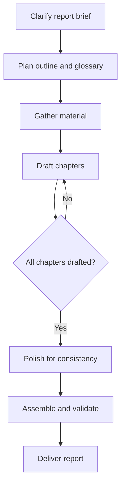

# Report Writing Workflow

## Overview

Writes long, multi-section reports that cannot fit in a single model reply by
splitting the work into a small persistent state file (outline + glossary) and
one file per chapter. Each chapter is drafted in its own bounded step, then a
second pass polishes terminology, cross-references, transitions, and tone across
the whole document. The parent conversation only ever holds the outline and
glossary in context; chapter bodies live on disk and are read back on demand.
This keeps the context window flat no matter how long the report grows, and it
makes resuming a report a matter of reading the outline status, not re-reading
the text.

## Flowchart

Every node has a matching step section below; node names are globally unique;
the decision node `All chapters drafted?` is explained in step-5 with its branches.

## Steps

### step-1: Clarify report brief
- **Tools**: `ask_user`
- **Input**: `inputs.topic` / `inputs.audience` / `inputs.length` / `inputs.format`
- **Action**: Capture the report brief. The topic, target reader, target length
  and output format usually come from the user's request; when any of them is
  ambiguous or missing, ask one short `ask_user` with options instead of guessing.
  If the user references an existing report, resolve that report directory first.
- **Check**: Topic is clear; audience and length are either stated or deliberately
  defaulted (audience = general, length = "comprehensive"); format resolved.
- **Branch**: none.

### step-2: Plan outline and glossary
- **Tools**: `write_file` / `read_file`
- **Input**: from step-1 brief
- **Action**: Create the report root `outputs/documents/report-<name>/` and write
  `outline.md` there from `assets/outline-template.md` (copy the template's
  structure, then fill in: brief, glossary table, and an ordered chapter list with
  target word counts, key points, and `Status: planned`). The outline file is the
  single source of truth for progress and the only persistent state kept in
  context. Show the chapter list to the user once (as a summary, not the file
  body) and confirm before drafting.
- **Check**: `outline.md` exists and is non-empty; every chapter has a number, a
  title, a target length, key points, and a status of `planned`; glossary has at
  least the top-level domain terms.

### step-3: Gather material
- **Tools**: `task` (explore subagents), `web_search`, `web_fetch`, `read_file`, `grep`
- **Depends on**: step-2
- **Action**: For each chapter that needs external facts, data, or references,
  dispatch **parallel** `explore` subagents (one per facet, all in one step,
  up to the machine's parallel slots). Each subagent returns a structured,
  source-tagged summary. Save each summary to `materials/NN-<facet>.md` under the
  report root so citations resolve to real files. Use built-in `web_search` /
  `web_fetch` directly for small lookups instead of spawning a subagent.
- **Check**: Every chapter that requires sources has a matching material file or
  a clear "no external material needed" note; material files are non-empty and
  record where each fact came from.

### step-4: Draft chapters
- **Tools**: `write_file` / `edit_file` / `read_file` / `grep` / `task` (general)
- **Depends on**: step-3 (or step-5 when looping back)
- **Action**: Draft chapters **one at a time, in outline order**. For each chapter:
  1. Keep in context only the outline, the glossary, and the current chapter's
     key points — never the full text of previous chapters.
  2. For continuity, `grep` the previous chapter for the specific terms/sections
     you need, or `read_file` just that one chapter; do not re-read everything.
  3. Write the chapter to `chapters/NN-<slug>.md` using `write_file` with the
     `chapter-template.md` structure. If a chapter is too long for one call,
     write the skeleton first, then extend with `edit_file` in a few chunks.
  4. After the chapter file is complete, update its `Status: drafted` in
     `outline.md` with a one-line note on where it ended (so resume is trivial).
  Prefer writing chapters directly in the loop. Use a `general` subagent only
  when a chapter needs long independent research AND writing; that subagent
  writes its own chapter file and you then just update the outline status —
  do not pull the full returned text into your working context.
- **Check**: The chapter file exists, is non-empty, follows the template, and
  covers all key points from the outline; every claim has a source marker that
  resolves to a material file or a verified web source.

### step-5: All chapters drafted?
- **Tools**: `read_file`
- **Depends on**: step-4
- **Action**: Re-read `outline.md` (or run `scripts/report_status.py <root>`) and
  check the status of every chapter.
- **Check**: The verdict is clear: all chapters `drafted` / none missing.
- **Branch**: Not all drafted → step-4 (continue from the first chapter whose
  status is not `drafted`); all drafted → step-6.

### step-6: Polish for consistency
- **Tools**: `read_file` / `edit_file` / `grep`
- **Depends on**: step-5 verdict "all drafted"
- **Action**: Second pass over the whole report, **one chapter at a time** (never
  all chapters in context at once). For each chapter, follow
  `references/consistency-guide.md`: unify terminology against the glossary, fix
  cross-references and numbering, smooth chapter transitions, and align tone.
  Apply fixes with `edit_file`; add any new term the text needs to the glossary.
  Update the chapter status to `polished` in `outline.md` when done.
- **Check**: Every chapter is `polished`; no leftover `TODO`/`TBD`/placeholder
  markers; glossary terms are used consistently; cross-references resolve.

### step-7: Assemble and validate
- **Tools**: `exec` / `read_file`
- **Input**: polished chapters from step-6
- **Action**: Merge chapters into the final document with
  `scripts/merge_report.py <root>` (prepends the report title from the outline
  and concatenates chapters in order). Validate with `scripts/report_status.py`
  again (it reports missing files and placeholder markers) and read the merged
  file's headings to confirm the structure is complete. If the user asked for a
  document format (docx/pdf/pptx), convert the merged markdown using the
  `make-docx` / `make-pdf` / `make-pptx` skill.
- **Check**: The merged report exists and is non-empty; all chapters appear in
  order; no placeholder markers; conversion (when requested) succeeded and the
  output is under `outputs/documents/`.

### step-8: Deliver report
- **Tools**: `glob`
- **Depends on**: step-7
- **Action**: List the final report files and tell the user: the report path,
  chapter list with word counts, what remains unfinished (if anything), and
  that replying "继续" resumes from the current outline status.
- **Check**: Output paths are shown and exist; the summary matches the outline.

## Process Rules

- **Only write under the report root** `outputs/documents/report-<name>/`
  (chapters under `chapters/`, materials under `materials/`). Never write into
  `skills/`, `uploads/`, `downloads/`, or other report roots.
- **Outline is the single source of truth**: every chapter write must be
  followed by an outline status update; never mark a chapter drafted before its
  file is complete on disk.
- **Keep the parent context flat**: the only persistent in-context state is the
  outline (plus glossary). Chapter bodies are files on disk; read them back via
  `grep`/`read_file` on demand, never by loading the whole report or the whole
  conversation history.
- **Draft in outline order, one chapter per bounded step**; do not attempt to
  draft two chapters in one reply — each chapter should be small enough to fit
  comfortably in the output budget.
- **No invented sources**: every claim carries a source marker that resolves to
  a material file or a verified web source. When evidence is missing, write that
  the point is unverified rather than fabricating data.
- **Resume**: when continuing a report, read `outline.md` first, find the first
  chapter whose status is not `drafted`, and continue from step-4. Never restart
  from scratch.
- **Two-pass is mandatory for reports with more than three chapters**; for short
  reports the polish pass may be merged into the draft pass.
- **Failure handling**: if a chapter's check fails, retry that chapter once with
  a changed approach; if it still fails, ask the user how to proceed (skip,
  shorten, or simplify) — never silently drop a chapter.

## Tool Call Conventions

- Enumerate the report root with `glob`/`list_dir`; never hand-build paths.
- Batch independent read-only calls (`grep` across chapters, `read_file` on the
  one chapter you need) in a single step to reduce round-trips.
- Use `write_file` for new chapter files and `edit_file` for polish edits; keep
  any single call's content within the output budget (chunk long chapters).
- Use `scripts/report_status.py <root>` for a compact progress/index view and
  `scripts/merge_report.py <root>` for assembly; prefer these deterministic
  scripts over ad-hoc shell pipelines.
- When the user hits output/context limits, read `references/config-guidance.md`
  and suggest the relevant setting — never change config yourself.
- Always use workspace-relative paths.

## Bundled Resources (Level 3, loaded on demand)

- Chapter-by-chapter polish checklist → `references/consistency-guide.md`
- Config tuning guidance for long reports → `references/config-guidance.md`
- Outline/glossary state-file template → `assets/outline-template.md`
- Chapter file template → `assets/chapter-template.md`
- Report progress/index view → `scripts/report_status.py`
- Chapter merge into a final document → `scripts/merge_report.py`
